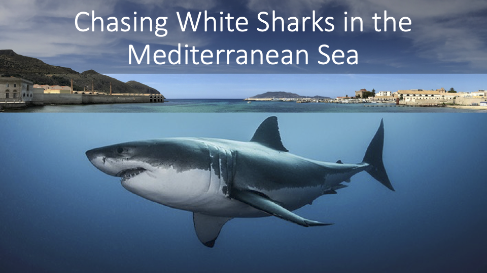
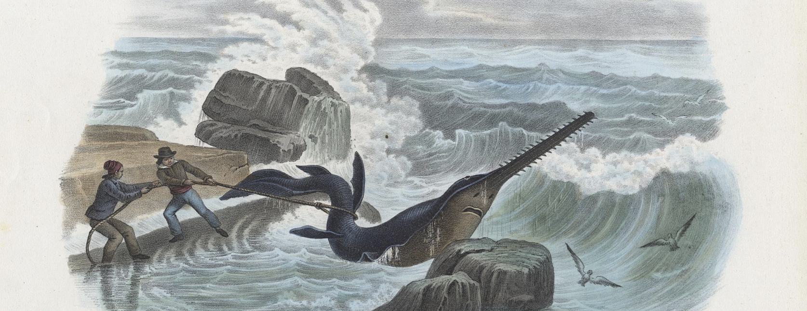
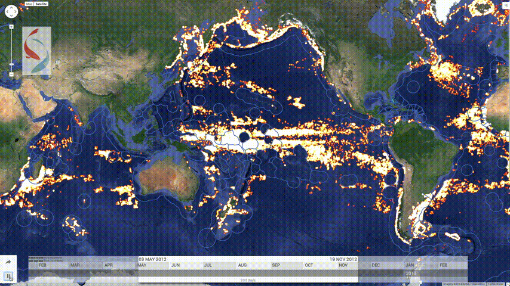
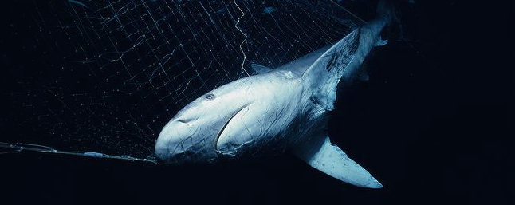
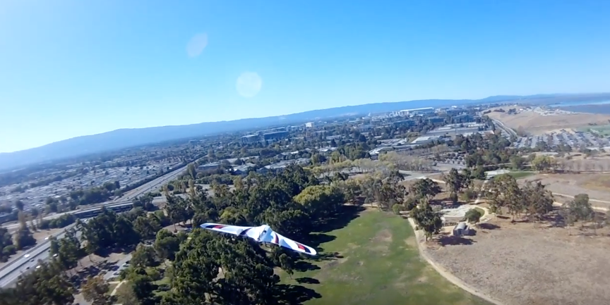

 

# The White Shark Chase

<figure>
 
<figcaption></figcaption>
</figure>

  
Tracking the last Mediterranean White Sharks (Click to expand)

  
 
  
Centuries of coastal fishing, and more recently, industrial exploitation have severely impacted this population, which, in the last few decades, has declined to very low levels of abundance. They were historically abundant and widely distributed in the region, and now they are critically endangered. We don’t know how many sharks are left and still know very little about their ecology and biology to protect them. Because they are scarce and have no aggregation areas similar to other regions, studying them in the field has always been challenging. To address this challenge, we started a multi-institutional monitoring program on white sharks in the Mediterranean Sea (click for [more details](http://seaql.org/index.php/research/tracking-white-sharks/)).

 

# From Historical Ecology to Ecoinformatics

 

## Reconstructing the History of Mediterranean Sawfish Populations

<figure>
 
<figcaption> Print contained in Boschi G. 1876. 7 - Pesci e Rettili, in: Atlante Zoologico Popolare, opera Compilata Sui Piu' Recenti Lavori di Zoologia Italiani e Stranieri.</figcaption>
</figure>

  
Characterize the identity and structure of extinct Mediterranean sawfish and neighboring Atlantic populations. (Click to expand)

  
 
  
Through archival digging, literature analyses, and extinction models, we provided evidence for the historical occurrence and subsequent extinction of two sawfish species in the Mediterranean Sea (Pristis pristis and Pristis pectinata) (Ferretti et al. 2016). This research challenged established tenets on sawfish ecology and biogeography, and led to a larger collaborative initiative for investigating on the structure, distribution, phylogeny, and biogeography of recently extinct sawfish populations. Within this project, we are conducting morphometric, genetic and isotopic analyses of sawfish materials from Mediterranean, European and Western African museums, to characterize the identity and structure of extinct Mediterranean sawfish and neighboring Atlantic populations.

 

## The Shark Baselines Project

 

The [Shark Baselines Project](http://baseline.stanford.edu) aims to investigate the structure and population abundance of large sharks in natural ecosystems and to infer global change in their abundance as an effect of human perturbation.

 

## Shark Pulse

 

  
 
  <a href="http://sharkpulse.org"> sharkPulse</a> is a crowdsourcing initiative to collect image-based sightings of sharks from all over the world. (Click to expand)

 
  
One of the biggest hurdles of shark conservation is the lack of data on abundance and distribution of about half of their species. To address this challenge we have developed <a href="http://sharkpulse.org"> sharkPulse</a>, a modular crowd-sourcing platform combining smartphone technology, web applications, social network/website crawling, computer vision, and machine learning for generating a large image-based sighting database for sharks. The goal is warehousing shark images available on the web and personal archives, and transform them into occurrence records. This platform aims to show how citizen science can be harnessed to produce big data, inform ecological science and promote conservation.   

 

# Big Data and New Technology for Ocean Solutions
 

## Toward Ocean Transparency

<figure>
 
</figure>

  
 Understanding patterns of high-seas fishing effort across the globe and how global fishing fleets interact with large pelagic fish and sharks. (Click to expand)

  
 
Illegal unreported and unregulated fishing (IUU) and resource overexploitation are among the biggest threats the ocean is facing today. Tackling these issues has been historically challenging because of inaccurate and incomplete fisheries statistics. In collaboration with the <a href="http://globalfishingwatch.org/"> Global Fishing Watch</a>, Google and other academic partners, I am analyzing a new global database of satellite tracking data for marine vessels to understand global patterns of high-seas fishing and how they interact with large pelagic fish and sharks. Specifically, I am combining these data with statistics of regional fisheries management organizations, reconstructed historical catch and effort data, and animal telemetry data to study drivers and dynamics of high-seas exploitation, overlaps between fish and fisheries’ domains, and cross-validate remotely sensed fishing fleet data with recorded fisheries statistics. 

 

## Management and Conservation Role of LMPA.

 

  
 Investigating on the impact of large marine protected areas on the management and conservation of sharks and other broad-ranging marine megafauna (Click to expand)

 

Very large marine protected areas (LMPA > 75,000 km2) are increasingly popular to protect the last strongholds of biodiversity in the ocean and promote recovery of heavily exploited regions. Yet not all agree on their value for management and conservation. Challenges are demonstrating that positive outcomes observed in smaller coastal MPAs also occur at such large scales and that monitoring and enforcement over vast and remote oceanic regions are possible. Through the <b>Bertarelli Programme in Marine Science</b>, an international collaborative initiative focused on the Chagos Archipelago in the British Indian Ocean Territory, I am investigating on the structure and function of pristine coral reef ecosystems, the impact of large marine protected areas on the management and conservation of sharks and other broad-ranging marine megafauna, the fundamental spatial ecology of these animals, and the effectiveness of mega-reserves in remote oceanic regions.

 

## Ocean Intelligence 

With an interdisciplinary team of biologists, oceanographers, naval and aerospace engineers, I am working on developing a set of innovative systems integrating new satellite tag technology, autonomous drones, machine learning, and big data, to detect illegal fishing in remote large marine reserves and the high-seas.

### The FAST tag projet
<figure>
 
<figcaption> (c) Jeff Rotman </figcaption>
</figure>

Developing anti-poaching satellite- and radio-tagging based technologies to aid monitoring and enforcement in remote large marine protected areas

### PoachBusters
<figure>
 
<figcaption> Test flight over Stanford Campus </figcaption>
</figure>

Designin monitoring systems using swarms of autonomous intelligent drones to detect fishing vessels as they intrude into restricted locations. 

