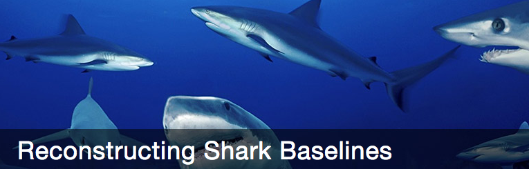

The Shark Baselines Project
-----------------------------

 

The [Shark Baselines Project](http://baseline.stanford.edu) aims to investigate the structure and population abundance of large sharks in natural ecosystems and to infer global change in their abundance as an effect of human perturbation.

Shark Pulse
-----------

 

[sharkPulse](http://sharkpulse.org) is a crowdsourcing initiative to collect image-based sightings of sharks from all over the world.

The Adriatic Marine Ecosystem Recovery
--------------------------------------

 

Studying the effect of establishing a large transboudary no trawl zone in the Adriatic Sea.

The FAST tag projet
-------------------
<figure>
 
<figcaption> (c) Jeff Rotman </figcaption>
</figure>

Developing anti-poaching satellite- and radio-tagging based technologies to aid monitoring and enforcement in remote large marine protected areas

PoachBusters
------------
<figure>
 
<figcaption> Test flight over Stanford Campus </figcaption>
</figure>

Designin monitoring systems using swarms of autonomous intelligent drones to detect fishing vessels as they intrude into restricted locations. 

Global Fishing Watch 
--------------------
<figure>
 
</figure>

As a research partner of the [Global Fishing Watch](http://globalfishingwatch.org/) I am working on understanding patterns of high-seas fishing effort across the globe and how global fishing fleets interact with large pelagic fish and sharks. This work will be applied to inform marine spatial planning and fisheries management for areas outside national jurisdictions. 

CSI Sawfish
-----------

Characterize the identity and structure of extinct Mediterranean sawfish and neighboring Atlantic populations.

<figure>
 
<figcaption> Rostrum of a largetooth sawfish displayed in the Sanctuary of
Carmine Maggiore in Napoli (read its story <a href="assets/Ferretti.solo.2014.pdf">here</a>).</figcaption>
</figure>

